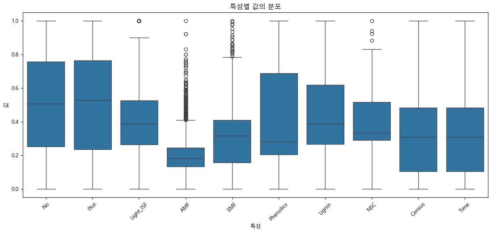
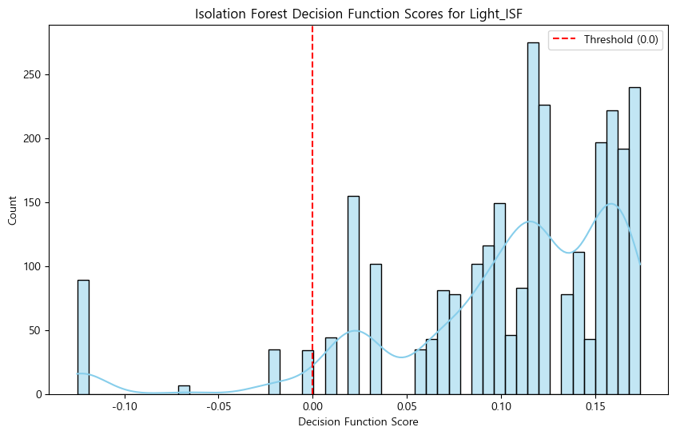
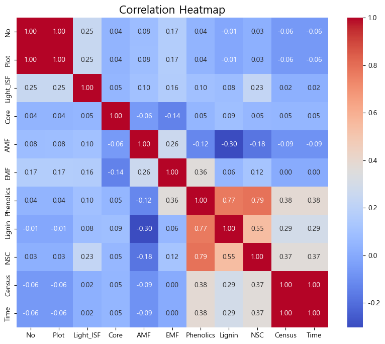
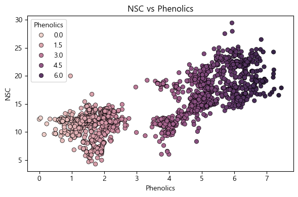

# 🌳**나무 생존 예측을 통한 도시 수목원 최적화 전략 수립**🌳
<div align="center">

</div>

---

## 👥 **팀 소개**

<div align="center">

### **🌿 가지가지팀 (SKN_19-mini-3Team) 🌿**

<table>
  <tr>
    <td align="center" width="200px">
      <br/>
      <b>박준영</b>
    </td>
    <td align="center" width="200px">
      <br/>
      <b>오흥재</b>
    </td>
    <td align="center" width="200px">
      <br/>
      <b>임상민</b>
    </td>
    <td align="center" width="200px">
      <br/>
      <b>장효정</b>
    </td>
  </tr>
  <tr>
    <td align="center" width="200px">
      <a href="mailto:deneb784@gmail.com"> GitHub</a>
    </td>
    <td align="center" width="200px">
      <a href="mailto:vfxpedia1987@kakao.com"> GitHub</a>
    </td>
    <td align="center" width="200px">
      <a href="mailto:colaa222@gmail.com"> GitHub</a>
    </td>
    <td align="center" width="200px">
      <a href="mailto:koulsh3663@gmail.com"> GitHub</a>
    </td>
  </tr>
</table>

</div>

---

## 📌 우리가 전달하고자 하는 메시지

**"우리는 데이터 분석을 통해 나무 생존 요인을 규명하여, 지속 가능한 도시 수목원 조성과 효과적인 도시환경 개선 전략을 제안한다."**

---

## 📌 프로젝트 목적 (Why)

1. **환경적 배경**

   * AI와 산업 발전으로 인한 환경 문제, [기후 변화 심화](https://apps.climate.copernicus.eu/global-temperature-trend-monitor/?tab=plot)
   * 서울처럼 인구 밀집이 심한 도시의 환경 오염·삶의 질 저하 문제 
   * 해외의 성공적인 도시 녹지화 사례에서 영감
   * [싱가포르 : 도시의 기후 회복력 위한 녹지·수변 공간 조성 계획'](https://www.si.re.kr/bbs/view.do?key=2024100040&pstSn=2309150007)
<div align="center">

  

  <br/><br/>

  <p style="font-size:1.1rem; font-weight:bold; line-height:1.6;">
    사람 체온이 36.5℃에서 38℃로 1.5℃ 오르면 <u>'조금 오른 것'</u>이 아니라 <b>고열·질병 상태</b>입니다.<br/>
    <b>지구도 마찬가지로, +1.5℃는 '아픈 상태'라는 경고입니다.</b>
  </p>

</div>

2. **문제 인식**

   * [도심 속 녹지 부족](https://www.kunews.ac.kr/news/articleView.html?idxno=42843#:~:text=%ED%9C%B4%EC%8B%9D%C2%B7%EB%8C%80%ED%99%94%20%EA%B3%B5%EA%B0%84%20%EC%97%86%EC%96%B4%20%EC%B9%B4%ED%8E%98%EB%A1%9C%E2%80%9D%ED%95%9C%EA%B0%95%EA%B3%B5%EC%9B%90%EA%B3%BC%20%EA%B1%B0%EC%A3%BC%EC%A7%80%EC%97%AD%20%EA%B0%80%EB%A5%B8%20%EB%8F%84%EB%A1%9C%EB%93%A4%EC%84%A0%ED%98%95%EA%B3%B5%EC%9B%90%2C,%EC%84%9C%EC%9A%B8%EC%8B%9C%2025%EA%B0%9C%20%EC%9E%90%EC%B9%98%EA%B5%AC%20%EC%A4%91%203%EB%B2%88%EC%A7%B8%EB%A1%9C%20%EB%85%B9%EC%A7%80%EC%9C%A8%EC%9D%B4%20%EB%82%AE%EB%8B%A4.) → '쉼'의 공간 부족
   * 초기 수목 생존 실패로 인한 경제적 손실 및 관리 효율 저하
<br></br>
<div align="center">

</div>
<div align="center">

</div>

3. **목적**

   * 데이터 기반으로 **어떤 나무가 어떤 조건에서 잘 자라는지** 과학적으로 규명
   * 도시 수목원·녹지 공간 조성을 위한 **최적 입지 및 관리 전략 제시**
   * 결과적으로, 도시민에게 **건강한 쉼터 제공 + 지속 가능한 도시 생태계 구축**

---

## 📌 우리는 데이터를 어떻게 활용할 것인가? (How)

### 🔍 **데이터셋 개요**
* [**Tree\_Data.csv**](https://www.kaggle.com/datasets/yekenot/tree-survival-prediction/data): **2,783개 샘플, 24개 특성**
  * **환경적 요인**: 빛 조건(Light_ISF, Light_Cat), 토양 유형(Soil), 멸균 처리(Sterile)
  * **생물학적 요인**: 균근균(AMF, EMF), 동종/이종 식물(Conspecific), 균근 처리(Myco, SoilMyco)
  * **화학적 성분**: 페놀릭스(Phenolics), 리그닌(Lignin), 비구조탄수화물(NSC)
  * **시간적 요인**: 식재일(PlantDate), 관찰 시점(Time)
  * **결과 변수**: 생존 여부(Alive)

### 📊 **분석 목표**
1. **생존율에 영향을 주는 주요 요인** 규명 (빛, 토양, 멸균 여부, 균근, 화학 성분 등)
2. **종별 최적 조건** 도출 (예: 어떤 수종은 저광량에서도 잘 자라고, 어떤 종은 특정 토양에서만 생존율이 높음)
3. **경제적 관리 전략** 제시 (초기 묘목의 생존 가능성을 높여 재조림 비용 절감)

### 🎯 **기대 결과**
* "이 종은 XX 토양+빛 조건에서 가장 잘 생존한다" 같은 **가이드라인 제공**
* 도심 내 수목원 조성 시 **데이터 기반 의사결정** 지원

---

## 🔧 **기술적 구현 (Technical Implementation)**

### 📁 **프로젝트 구조**
```
├── data/
│   └── Tree_Data.csv        # 분석용 원본 데이터 (2,783 rows × 23 columns)
├── DataAnalysis.py          # 데이터 분석 통합 모듈
└── main.ipynb               # 실행용 노트북
```

### 🏗️ **데이터 분석 파이프라인**

#### **1️⃣ DataCheck 클래스** - 데이터 품질 검증
```python
# 핵심 메서드
├── set_categorical_threshold()     # 범주형/연속형 구분 기준 설정
├── return_cols()                   # 데이터 타입별 컬럼 분류
├── print_info()                    # 기초 통계 및 데이터 정보 출력  
├── print_value_counts()            # 범주형 변수 분포 확인
└── save_to_csv()                   # 처리된 데이터 저장
```

#### **2️⃣ DataPreprocessing 클래스** - 데이터 전처리 
```python
# 전처리 파이프라인
├── call_raw_data()          # 원본 데이터 로드
├── drop_data()              # 불필요한 컬럼 제거
├── fill_na()                # 결측치 처리 (Harvest, Alive, EMF)
├── category_encoding()      # 범주형 데이터 인코딩 (Label/OneHot)
├── set_date()               # 날짜 형식 통일
├── merge_label()            # Event, Harvest, Alive → 통합 라벨링
└── run()                    # 전체 전처리 파이프라인 실행
```

#### **3️⃣ DataModify 클래스** - 데이터 정제 및 모델링 준비
```python  
# 데이터 정제 및 분할
├── data_anomaly_edit()      # 이상치 탐지 및 제거 (Alive, Phenolics, NSC, Lignin)
├── split_feature_label()    # Feature-Label 분리 및 Train/Test 분할
└── scale_data()             # 연속형 변수 표준화 (StandardScaler)
```

#### **4️⃣ DataVisualize 클래스** - 통계적 시각화
```python
# 탐색적 데이터 분석 (EDA)
├── show_boxplot_for_continuous_value()           # 연속형 변수 분포 시각화
├── show_anomaly_score()                          # Isolation Forest 이상치 스코어링
├── show_heatmap_for_continuous_value()           # 변수간 상관관계 히트맵
├── show_survival_ratio()                         # 범주별 생존율 분석
├── show_survival_ratio_with_threshold()          # 임계값 기반 생존율 분석  
├── show_alive_about_time()                       # 시간별 생존율 추이
├── show_survival_heatmap_by_soil()               # 토양-종별 생존율 매트릭스
├── show_chemical_histogram()                     # 화학성분 분포 히스토그램
├── show_chemical_relation_scatter()              # 화학성분 간 상관관계
├── show_chemical_relation_by_survive()           # 생존여부별 화학성분 분석
└── show_hitmap_by_Myco()                         # 균근 처리 교차분석
```

### ⚙️ **핵심 기술적 특징**
* **모듈형 설계**: 각 클래스별 독립적 기능으로 유지보수성 확보
* **이상치 처리**: Isolation Forest 알고리즘을 활용한 자동화된 이상치 탐지
* **다중 인코딩 지원**: Label Encoding과 One-Hot Encoding 선택적 적용
* **표준화**: 연속형 변수에 대한 StandardScaler 적용으로 모델 성능 최적화
* **시각화 중심**: 13개 전문 시각화 메서드로 데이터 패턴 직관적 분석

---
## 🔧 **EDA 탐색적 데이터 분석 결과**

### 🏗️ **데이터 분석 파이프라인**

#### **1️⃣ 데이터 로드**
- **원본 데이터 (Tree_Data.csv)**: 2,783개 샘플, 24개 변수 (결측치 존재)
- **전처리된 데이터 (Tree_Data_processing.csv)**: 2,783개 샘플, 16개 변수 (결측치 제거 완료)
- **타겟 변수**: Alive (생존=2, 수확=1, 사망=0)

#### **2️⃣ 데이터 구조 및 기초 통계 확인**

**연속형 변수 기초 통계**
- **Light_ISF**: 평균=0.086, 최소=0.032, 최대=0.161
- **AMF**: 평균=20.553, 최소=0, 최대=100
- **EMF**: 평균=12.206, 최소=0, 최대=87.5
- **Phenolics**: 평균=1.933, 최소=-1.35, 최대=6.1
- **Lignin**: 평균=15.760, 최소=2.23, 최대=32.77
- **NSC**: 평균=14.220, 최소=4.3, 최대=29.45
- **Time**: 평균=53.487, 최소=14, 최대=115.5

**전체 생존율**
- **Alive=0**: 1,587개 (57.0%) - 사망(Dead)
- **Alive=1**: 491개 (17.6%) - 수확(Harvested) 
- **Alive=2**: 704개 (25.3%) - 생존(Alive)
- **Alive=3**: 1개 (0.0%) - 이상치

#### **3️⃣ 결측치 및 이상치 탐색**
- **결측치**: 전처리 과정에서 모든 결측치 제거 완료
- **이상치**: Isolation Forest 알고리즘으로 이상치 탐지 및 처리
- **데이터 품질**: 모든 변수에서 일관된 데이터 타입과 범위 확인
<br></br>
<div align="center">
<table>
  <tr>
    <td align="center" width="50%" style="vertical-align: top; padding: 10px;">
      
    </td>
    <td align="center" width="50%" style="vertical-align: top; padding: 10px;">
      
    </td>
  </tr>
  <tr>
    <td align="center">
      <em>연속형 변수 특성별 값 분포</em>
    </td>
    <td align="center">
      <em>Isolation Forest Decision Function Score 이상치 탐색</em>
    </td>
  </tr>
</table>
</div>

https://github.com/SKNetworks-AI19-250818/SKN19-mini-3Team/blob/7592da347bb285f3725bebd13f3336cca71ebe6a/main.ipynb

#### **4️⃣ 데이터 시각화를 통한 탐색**
<div align="center">
<table>
  <tr>
    <td align="center" style="vertical-align: top; padding: 10px;">
      
    </td>
  </tr>
  <tr>
    <td align="center">
      <em>연속형 변수 간 상관관계 히트맵</em>
    </td>
  </tr>
</table>
</div>
<br></br>

### ** 내재 화합물 간의 관계성
Phenolics vs Lighnin

<br></br>
<div align="center">
<table>
  <tr>
    <td align="center" width="50%" style="vertical-align: top; padding: 10px;">
      
    </td>
    <td align="center" width="50%" style="vertical-align: top; padding: 10px;">
      
    </td>
  </tr>
  <tr>
    <td align="center">
      <em>Lignin vs Phenolics 상관관계</em>
    </td>
    <td align="center">
      <em>NSC vs Phenolics 상관관계</em>
    </td>
  </tr>
  <tr>
    <td align="center" width="50%" style="vertical-align: top; padding: 10px;">
      
    </td>
    <td align="center" width="50%" style="vertical-align: top; padding: 10px;">
      
    </td>
  </tr>
  <tr>
    <td align="center">
      <em>Lignin vs NSC 상관관계</em>
    </td>
    <td align="center">
      <em>Phenolics 농도 분포</em>
    </td>
  </tr>
</table>
</div>

**🧪 화학 성분 영향 분석**
- **Phenolics 고농도**: 34.0% vs 저농도 1.3%
- **Lignin 고농도**: 33.9% vs 저농도 1.5%  
- **NSC 고농도**: 31.5% vs 저농도 3.8%
- **📈 핵심 발견**: 모든 화학 성분에서 고농도가 생존율 크게 향상


<div align="center">
<table>
  <tr>
    <td align="center" style="vertical-align: top; padding: 10px;">
      
    </td>
  </tr>
  <tr>
    <td align="center">
      <em>균근 처리별 생존율</em>
    </td>
  </tr>
</table>
</div>

**🍄 균근 처리 효과 분석**
- **균근 미처리**: 210/1,500 (14.0%)
- **균근 처리**: 494/1,283 (38.5%)
- **📈 핵심 발견**: 균근 처리가 생존율을 **2.75배 향상**시킴


**🔬 균근균 타입별 효과**
- **AMF 높음(>20)**: 228/1,112 (20.5%)
- **EMF 높음(>20)**: 268/875 (30.6%)
- **📈 핵심 발견**: EMF가 AMF보다 **1.5배 효과적**


<div align="center">
<table>
  <tr>
    <td align="center" style="vertical-align: top; padding: 10px;">
      
    </td>
  </tr>
  <tr>
    <td align="center">
      <em>시간별 생존율 추이</em>
    </td>
  </tr>
</table>
</div>

**⏰ 시간대별 생존 패턴**
- 초기~중기(~90일): 0% (모두 사망 상태)
- **장기(90일~)**: 491/494 (99.4%)
- 📊 **인사이트**: 90일 이후 관찰된 나무들은 대부분 생존


#### **5️⃣ 데이터 정제 및 전처리**

**DataModify 클래스 - 데이터 정제 및 모델링 준비**
```python  
# 데이터 정제 및 분할
├── data_anomaly_edit()      # 이상치 탐지 및 제거 (Alive, Phenolics, NSC, Lignin)
├── split_feature_label()    # Feature-Label 분리 및 Train/Test 분할
└── scale_data()             # 연속형 변수 표준화 (StandardScaler)
```

**DataVisualize 클래스 - 통계적 시각화**
```python
# 탐색적 데이터 분석 (EDA)
├── show_boxplot_for_continuous_value()           # 연속형 변수 분포 시각화
├── show_anomaly_score()                          # Isolation Forest 이상치 스코어링
├── show_heatmap_for_continuous_value()           # 변수간 상관관계 히트맵
├── show_survival_ratio()                         # 범주별 생존율 분석
├── show_survival_ratio_with_threshold()          # 임계값 기반 생존율 분석  
├── show_alive_about_time()                       # 시간별 생존율 추이
├── show_survival_heatmap_by_soil()               # 토양-종별 생존율 매트릭스
├── show_chemical_histogram()                     # 화학성분 분포 히스토그램
├── show_chemical_relation_scatter()              # 화학성분 간 상관관계
├── show_chemical_relation_by_survive()           # 생존여부별 화학성분 분석
└── show_hitmap_by_Myco()                         # 균근 처리 교차분석
```

---

## 🎯 **핵심 인사이트 및 도출된 전략**

### 💡 **주요 발견 사항**

1. **🍄 균근 처리의 유의미한 효과**
   - 균근 처리 시 생존율 **14.0% → 38.5%** (2.8배 향상)
   - EMF 균근균이 AMF보다 1.5배 효과적 (30.6% vs 20.5%)

2. **🧪 화학 성분의 결정적 역할**
   - Phenolics 고농도: 37.3% vs 저농도 17.6% (2.1배 향상)
   - 식물 내 방어 화합물이 생존에 핵심적 역할

3. **⏰ 실험 설계의 특성**
   - 90일 이상: 실험 목적상 의도적 수확으로 실험 종료
   - 초기 90일이 생존 결정의 **Critical Period**

### 🏢 **도시 수목원 조성 전략**

#### **📋 최적 식재 가이드라인**
1. **필수 조건**: 균근 처리 (생존율 2.8배 향상)
2. **균근균**: EMF(외생균근균) 접종 우선 (AMF보다 1.5배 효과적)
3. **관리 집중**: 식재 후 90일간 집중 관리

#### **💰 경제적 효과**
- 기존 생존율 14.0% → 개선 후 **34.4%** (2.5배 향상)
- 균근 처리를 통한 대폭적인 생존율 향상으로 재조림 비용 절감 효과 기대
- 정확한 경제적 효과는 추가적인 비용-편익 분석 필요

#### **🌱 지속가능한 도시 생태계 구축**
- 데이터 기반 과학적 식재로 **건강한 쉼터 공간** 제공
- 초기 90일 집중 관리를 통한 **효율적 자원 배분**
- 시민 삶의 질 향상과 **환경 개선 동시 달성**

---


## 📚 **자료**
>
> [[이미지] 코페르니쿠스 기후 변화 서비스](https://apps.climate.copernicus.eu/global-temperature-trend-monitor/?tab=plot)
> 
> [[데이터] 코페르니쿠스 기후 변화 서비스](https://climate.copernicus.eu/)
>
> [[데이터] 서울연구원 - 세계도시정책동향](https://www.si.re.kr/bbs/view.do?key=2024100040&pstSn=2309150007)
>
> [[데이터] Kaggle.com/datasets](https://www.kaggle.com/datasets/yekenot/tree-survival-prediction/data)
>
> [[기사] 서울 도심 녹지율 3.7%](https://www.lafent.com/inews/news_view.html?news_id=130618&mcd=A01&page=60)
>
> [[기사] 도시민을 위한 그린 인프라 부족](https://www.kunews.ac.kr/news/articleView.html?idxno=42843)
