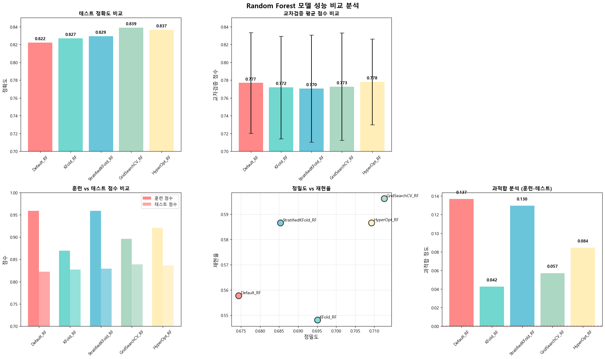
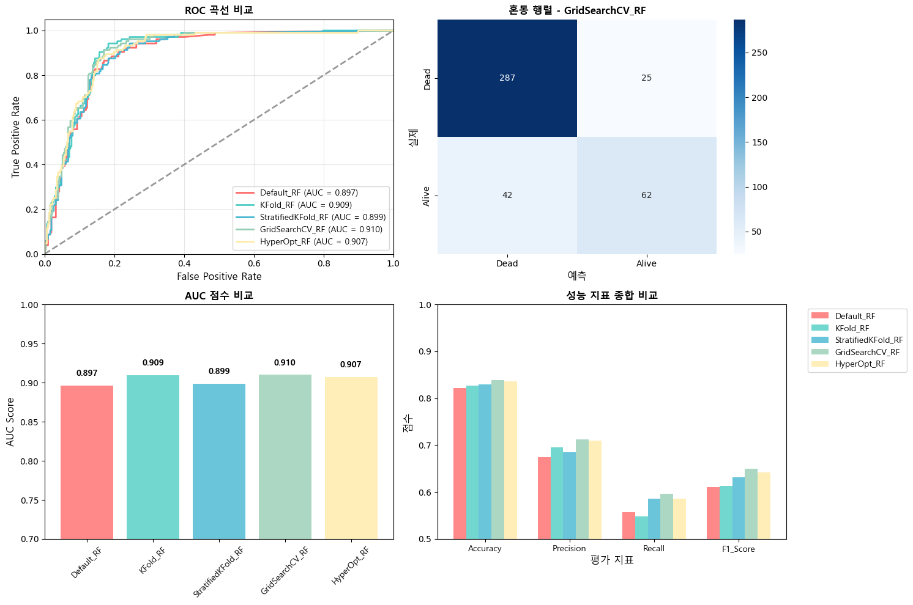
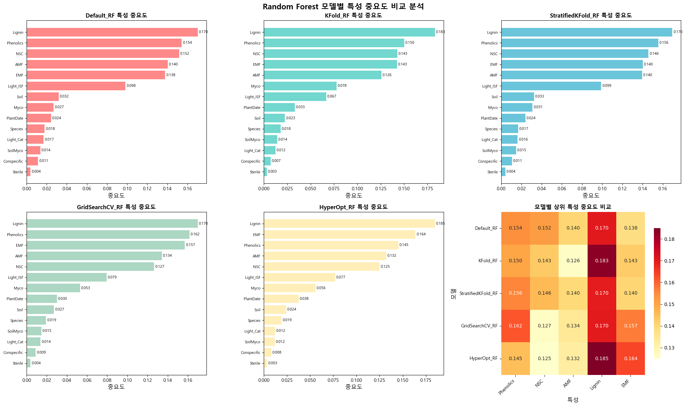
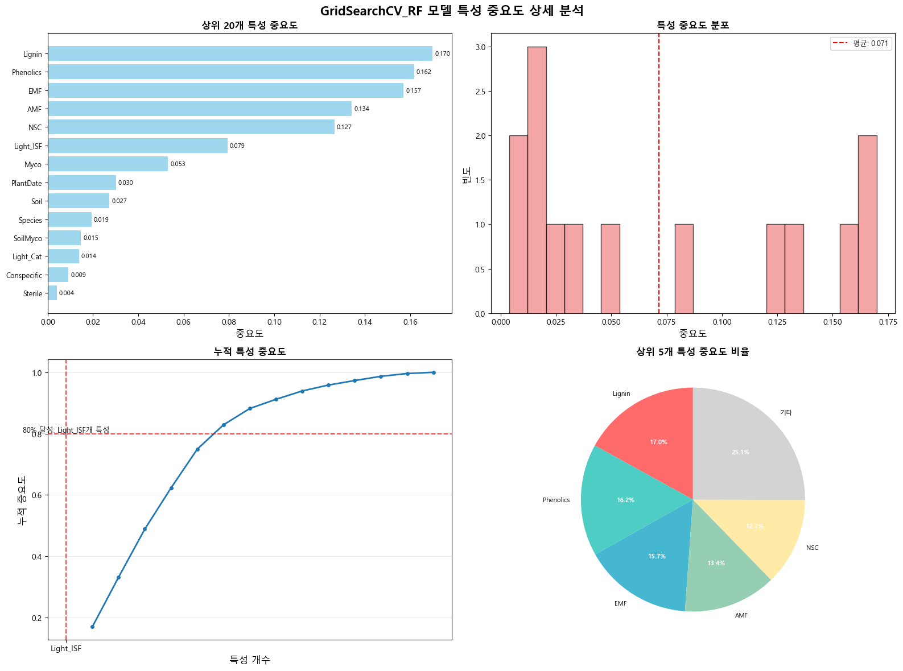

# 묘목 생존율 예측 모델 프로젝트

## 프로젝트 개요
본 프로젝트는 묘목의 생존율을 예측하기 위한 머신러닝 모델을 개발하는 프로젝트입니다.
초기의 단순 분류 모델에서 시작하여, 시간에 따른 생존율을 예측할 수 있는 고도화된 생존 분석 모델까지 구현하였습니다.

## 목차
1. [EDA를 기반으로 한 데이터 전처리](#1-eda를-기반으로-한-데이터-전처리)
2. [분류 모델을 이용한 묘목의 생존 여부 예측](#2-분류-모델을-이용한-묘목의-생존-여부-예측)
3. [기존 모델의 한계 및 새로운 모델 기획](#3-기존-모델의-한계-및-새로운-모델-기획)
4. [시간에 따른 생존율을 예측하는 모델 구현 및 평가](#4-시간에-따른-생존율을-예측하는-모델-구현-및-평가)
5. [모델 평가 방식과 성능 고도화 기법](#5-모델-평가-방식과-성능-고도화-기법)
6. [트러블 슈팅](#6-트러블-슈팅)

---

## 1. EDA를 기반으로 한 데이터 전처리

### 데이터 개요
EDA를 통해 분석한 데이터를 기반으로 데이터 전처리 및 인코딩을 수행하였습니다.

### 주요 특성(Features) 및 라벨(Labels)

| 변수명 | 설명 |
|--------|------|
| **Species** | 나무 종명 |
| **Light_ISF** | 조도 (받는 햇빛의 양) |
| **Light_Cat** | 빛의 세기 |
| **Soil** | 토양의 출처 |
| **Sterile** | 토양의 살균 여부 |
| **Conspecific** | 토양의 타입 (동종에서 채취한 토양, 이종에서 채취한 토양,...) |
| **Myco** | 나무에서 발견되는 균의 종류 |
| **SoilMyco** | 토양에서 발견되는 균의 종류 |
| **PlantDate** | 식재일 |
| **AMF** | AMF균의 비율 |
| **EMF** | EMF균의 비율 |
| **Phenolics** | 페놀 화합물의 함유량 |
| **Lignin** | 리그닌의 비율 |
| **NSC** | NSC의 비율 |
| **Time** | 사건(사망 혹은 측정 종료)가 발생한 시간 |
| **Alive** | 사건 종류 (생존/사망) |

### 전처리 과정
다음과 같은 순서로 데이터 전처리를 진행하였습니다:

```
데이터 드랍 → 이상치 처리 → 결측치 처리 → 날짜값 통일 → 라벨 데이터 통합 → 인코딩
```

**[데이터 분포 시각화 자료 위치]**
> *데이터의 분포, 결측치 현황, 이상치 탐지 결과 등의 시각화 자료*

---

## 2. 분류 모델을 이용한 묘목의 생존 여부 예측

### 모델링 목표

분류 모델을 이용하여 2 성장기가 지난 묘목(약 120일 후)의 생존율을 예측합니다.

2 성장기가 지나면 생존율이 매우 안정화되므로, 해당 기간까지의 생존율 예측이 매우 중요합니다.

**[실제 묘목의 생존율 그래프 위치]**
> *시간에 따른 묘목 생존율 변화를 보여주는 그래프*

### 사용 모델
3개의 분류 모델을 사용하여 분류를 수행하였습니다:

#### 1. Logistic Regression
**[Logistic Regression 결과 시각화 위치]**
> *모델 성능 지표, ROC 곡선, 특성 중요도 등*

**주요 결과:**
- 정확도: [수치]
- 정밀도: [수치]
- 재현율: [수치]
- F1-score: [수치]

#### 2. Random Forest
**[Random Forest 결과 시각화 위치]**
> *모델 성능 지표, 특성 중요도, 트리 구조 등*

##### 2.1. 기본 랜덤포레스트

모델 설정
```python
# 기본 Random Forest 모델 생성
rf_default = RandomForestClassifier(
    n_estimators=100,        # 트리 개수
    random_state=42,         # 재현 가능한 결과
    n_jobs=-1                # 모든 CPU 코어 사용
)
# 학습
rf.fit(X_train, y_train)

# 훈련모델 평가 출력
train_model_evaluation(rf, X_train, y_train, X_test, y_test)
# 평가지표 출력
evaluate_binary_classification(y_test, y_pred)
```
모델 평가 결과
```sh
============================================================
📊 Default Random Forest 모델 평가
============================================================
Training Score     : 0.9573
Testing Score      : 0.8125
Cross Validation   : 0.7730 (±0.0507)
============================================================

📈 Default Random Forest 상세 성능 지표
============================================================
Accuracy           : 0.8125
Precision          : 0.7349
Recall             : 0.5214
F1 Score           : 0.6100
Confusion Matrix   :
                   [277  22]
                   [ 56  61]
```
##### 2.2. KFold Random Forest 모델 (정규화)

모델 설정
```python
# 정규화된 Random Forest 모델 생성 (과적합 방지)
rf_kfold = RandomForestClassifier(
    n_estimators=50,           # 트리 수 감소
    max_depth=10,              # 최대 깊이 제한
    min_samples_split=10,      # 분할 최소 샘플 수 증가
    min_samples_leaf=5,        # 리프 최소 샘플 수 증가
    max_features='sqrt',       # 피처 수 제한
    random_state=42,
    n_jobs=-1
)
```
모델 평가 결과
```sh
============================================================
📊 KFold Random Forest 모델 평가
============================================================
Training Score     : 0.9294
Testing Score      : 0.7865
Cross Validation   : 0.7752 (±0.0101)
============================================================

📈 KFold Random Forest 상세 성능 지표
============================================================
Accuracy           : 0.7865
Precision          : 0.5843
Recall             : 0.4483
F1 Score           : 0.5073
Confusion Matrix   :
                   [320  37]
                   [ 64  52]
```

##### 2.3. StratifiedKFold 랜덤포레스트

모델 설정
```python
# 대용량 Random Forest 모델 생성 (클래스 불균형 대응)
rf_stratified = RandomForestClassifier(
    n_estimators=200,          # 트리 수 증가
    max_depth=None,            # 깊이 제한 없음
    min_samples_split=2,       # 기본값
    min_samples_leaf=1,        # 기본값
    max_features='log2',       # 피처 수 제한
    bootstrap=True,            # 부트스트랩 샘플링
    random_state=42,
    n_jobs=-1
)
```
모델 평가 결과
```sh
============================================================
📊 StratifiedKFold Random Forest 모델 평가
============================================================
Training Score     : 0.9289
Testing Score      : 0.7949
Cross Validation   : 0.7861 (±0.0102)
============================================================

📈 StratifiedKFold Random Forest 상세 성능 지표
============================================================
Accuracy           : 0.7949
Precision          : 0.5824
Recall             : 0.4732
F1 Score           : 0.5222
Confusion Matrix   :
                   [323  38]
                   [ 59  53]
```

##### 2.4. GridSearchCV 랜덤포레스트

모델 설정
```python
# 하이퍼파라미터 탐색 범위 설정
param_grid = {
    'n_estimators': [50, 100, 200],
    'max_depth': [None, 10, 20, 30],
    'min_samples_split': [2, 5, 10],
    'min_samples_leaf': [1, 2, 4],
    'max_features': ['sqrt', 'log2'],
    'bootstrap': [True, False]
}

# GridSearchCV 설정
grid_search = GridSearchCV(
    estimator=rf_base,
    param_grid=param_grid,
    scoring='accuracy',
    cv=5,
    n_jobs=-1,
    verbose=1
)
```

최적 파라미터터
```python
최적 파라미터: {
    'bootstrap': True, 
    'max_depth': 15, 
    'max_features': 'sqrt', 
    'min_samples_leaf': 1, 
    'min_samples_split': 15, 
    'n_estimators': 50
}
```
모델 평가 결과
```sh
============================================================
📊 GridSearchCV Random Forest 모델 평가
============================================================
Training Score     : 0.8952
Testing Score      : 0.8125
Cross Validation   : 0.7899
============================================================

📈 GridSearchCV Random Forest 상세 성능 지표
============================================================
Accuracy           : 0.8125
Precision          : 0.7671
Recall             : 0.4786
F1 Score           : 0.5895
Confusion Matrix   :
                   [277  22]
                   [ 56  61]
```

##### 2.5. HyperOpt 랜덤포레스트

모델 설정
```python
# 탐색 공간 정의
search_space = {
    'n_estimators': hp.quniform('n_estimators', 50, 300, 25),
    'max_depth': hp.quniform('max_depth', 5, 25, 1),
    'min_samples_split': hp.quniform('min_samples_split', 2, 15, 1),
    'min_samples_leaf': hp.quniform('min_samples_leaf', 1, 8, 1),
    'max_features': hp.choice('max_features', ['sqrt', 'log2']),
    'bootstrap': hp.choice('bootstrap', [True, False]),
    'random_state': 42
}
```
최적 파라미터
```python
최적 파라미터: {
    'n_estimators': 80, 
    'max_depth': 28, 
    'min_samples_split': 16, 
    'min_samples_leaf': 4, 
    'max_features': 'log2', 
    'bootstrap': True, 
    'random_state': 42, 
    'n_jobs': -1
}
```
모델 평가 결과
```sh
============================================================
📊 HyperOpt Random Forest 모델 평가
============================================================
Training Score     : 0.8867
Testing Score      : 0.8077
Cross Validation   : 0.7798 (±0.0536)
============================================================

📈 HyperOpt Random Forest 상세 성능 지표
============================================================
Accuracy           : 0.8077
Precision          : 0.7606
Recall             : 0.4615
F1 Score           : 0.5745
Confusion Matrix   :
                   [286  33]
                   [ 47  50]
```


**주요 결과:**
---

#### 2.6. 📊 Random Forest 모델 성능 비교 결과

성능 비교 테이블:
| Model              | Train_Score| Test_Score | CV_Mean   | CV_Std    | Accuracy | Precision| Recall   | F1_Score |
|---------------------|-----------|------------|-----------|-----------|----------|----------|----------|----------|
| **Default_RF**        | 0.9590    | 0.8221     | 0.7768    | 0.0565    | 0.8221   | 0.6744   | 0.5577   | 0.6105   |
| **KFold_RF**          | 0.8694    | 0.8269     | 0.7718    | 0.0577    | 0.8269   | 0.6951   | 0.5481   | 0.6129   |
| **StratifiedKFold_RF**| 0.9590    | 0.8293     | 0.7705    | 0.0601    | 0.8293   | 0.6854   | 0.5865   | 0.6321   |
| **GridSearchCV_RF**   | 0.8960    | 0.8389     | 0.7726    | 0.0603    | 0.8389   | 0.7126   | 0.5962   | 0.6492   |
| **HyperOpt_RF**       | 0.9210    | 0.8365     | 0.7781    | 0.0483    | 0.8365   | 0.7093   | 0.5865   | 0.6421   |

---

🎨 시각화 자료

1. 성능 비교 차트
- **테스트 정확도 비교**  : 각 모델별 정확도 막대 그래프
- **교차검증 점수 비교**  : 일반화 성능 비교 (오차막대 포함)
- **F1 점수 비교**      : 정밀도와 재현율의 조화평균
- **훈련 vs 테스트 점수**: 과적합 분석
- **정밀도 vs 재현율**   : 분류 성능 트레이드오프
- **과적합 분석**        : 모델별 과적합 정도
<br></br>
<div align="center">
<table>
  <tr>
    <td align="center" style="vertical-align: top; padding: 10px;">
      
    </td>
  </tr>
  <tr>
    <td align="center">
      <em>Random Forest 모델 성능 비교 분석</em>
    </td>
  </tr>
</table>
</div>
<br></br>
2. ROC 곡선 및 혼동 행렬 분석
- **ROC 곡선 비교**     : 각 모델별 분류 성능 비교
- **혼동 행렬 히트맵**   : 최고 성능 모델의 상세 분석
- **AUC 점수 비교**     : 모델별 분류 성능 순위
- **성능 지표 종합 비교**: 4가지 지표 종합 분석
<br></br>
<div align="center">
<table>
  <tr>
    <td align="center" style="vertical-align: top; padding: 10px;">
      
    </td>
  </tr>
  <tr>
    <td align="center">
      <em>Random Forest 모델 성능 비교 분석</em>
    </td>
  </tr>
</table>
</div>
<br></br>
3. 특성 중요도 분석
- **모델별 특성 중요도 비교** : 5개 모델의 특성 중요도 나란히 비교
- **최고 성능 모델 상세 분석**: Default_RF 모델의 특성 중요도 심층 분석
- **특성 중요도 분포**       : 중요도 분포 히스토그램 및 통계 분석
- **누적 중요도 곡선**       : 80% 중요도 달성에 필요한 특성 수 분석
- **상위 특성 비율**         : 상위 5개 특성의 중요도 비율 파이 차트
<div align="center">
<table>
  <tr>
    <td align="center" style="vertical-align: top; padding: 10px;">
      
    </td>
  </tr>
  <tr>
    <td align="center">
      <em>Random Forest 모델별 특성 중요도 비교 분석</em>
    </td>
  </tr>
</table>
</div>
<br></br>
<div align="center">
<table>
  <tr>
    <td align="center" style="vertical-align: top; padding: 10px;">
      
    </td>
  </tr>
  <tr>
    <td align="center">
      <em>GridSearchCV_RF 모델 특성 중요도 상세 분석</em>
    </td>
  </tr>
</table>
</div>
<br></br>


---

##### 2.7. 📈 종합 분석 및 결론

 🏆 모델 성능 순위 및 주요 지표 (정확도 기준)
 
 | 순위 | 모델명                | 테스트 정확도 | F1 점수  | 교차검증 점수 | 과적합(훈련-테스트) | 과적합 해석      | AUC 점수 |
 |------|----------------------|---------------|----------|---------------|--------------------|------------------|----------|
 | 1    |  <span style="color: red;"> **GridSearchCV_RF**  </span> |  <span style="color: red;"> 0.8389 </span>       |<span style="color: red;"> 0.6492 </span>   |<span style="color: red;"> 0.7726 </span> |<span style="color: red;"> 0.0571 </span> | 🟡 <span style="color: orange;"> 주의 필요 </span> |<span style="color: red;"> 0.9100 </span>  |
 | 2    | **HyperOpt_RF**       | 0.8365        | 0.6421   | 0.7781        | 0.0844             | 🟡 주의 필요     | 0.9070   |
 | 3    | **StratifiedKFold_RF**| 0.8293        | 0.6321   | 0.7861        | 0.1297             | 🔴 심한 과적합   | 0.8985   |
 | 4    | **KFold_RF**          | 0.8269        | 0.6129   | 0.7752        | 0.0425             | 🟢 적절          | 0.9095   |
 | 5    | **Default_RF**        | 0.8221        | 0.6105   | 0.7768        | 0.1369             | 🔴 심한 과적합   | 0.8965   |
 
 🥇 **최고 성능 모델:**  
 - 모델명: GridSearchCV_RF  
 - 테스트 정확도: 0.8389  
 - F1 점수: 0.6492  
 - 교차검증 점수: 0.7726  
 - AUC 점수: 0.9100  
 
 ⚠️ **과적합 해석:**  
 - 0.10 이상     : 🔴 심한 과적합  
 - 0.05~0.10 미만: 🟡 주의 필요  
 - 0.05 미만     : 🟢 적절  
 
 ※ GridSearchCV_RF가 정확도, F1, AUC 등 모든 주요 지표에서 가장 우수함을 확인할 수 있습니다.

🔍 특성 중요도 분석 결과

📊 최고 성능 모델 (GridSearchCV_RF) 특성 중요도
- **분석 기준**             : F1 점수 0.6492로 최고 성능을 보인 GridSearchCV_RF 모델
- **전체 특성 수**          : 16개
- **80% 중요도 달성 특성 수**: 9개

🏆 상위 10개 중요 특성 (GridSearchCV_RF 기준)

| 순위 | 특성명        | 중요도    | 설명                                      |
|------|--------------|-----------|-------------------------------------------|
| 1    | Lignin       | 0.1698    | 리그닌의 비율 (나무의 구조적 강도와 관련) |
| 2    | Phenolics    | 0.1617    | 페놀 화합물의 함유량 (식물의 방어 메커니즘)|
| 3    | EMF          | 0.1570    | EMF균의 비율 (외생균근균, 나무와 공생하는 균류)|
| 4    | AMF          | 0.1342    | AMF균의 비율 (내생균근균, 식물 뿌리와 공생)|
| 5    | NSC          | 0.1266    | NSC의 비율 (비구조적 탄수화물, 에너지 저장)|
| 6    | Light_ISF    | 0.0793    | 조도 (받는 햇빛의 양)                     |
| 7    | Myco         | 0.0531    | 나무에서 발견되는 균의 종류               |
| 8    | PlantDate    | 0.0301    | 식재일                                    |
| 9    | Soil         | 0.0272    | 토양의 출처                               |
| 10   | Species      | 0.0193    | 나무 종명                                 |

📈 특성 중요도 통계 (GridSearchCV_RF 기준)
- **평균 중요도**   : 0.0714
- **중요도 표준편차**: 0.0644
- **최대 중요도**   : 0.1698 (Lignin)
- **최소 중요도**   : 0.0040

🎯 특성 선택 가이드
- **핵심 특성**    : 상위 5개 특성이 전체 중요도의 75.0% 차지 (Lignin, Phenolics, EMF, AMF, NSC)
- **특성 제거 고려**: 중요도가 0.030 이하인 특성들 (PlantDate, Soil, Species 등)
- **모델 단순화**  : 상위 9개 특성만으로도 80% 성능 유지 가능

💡 최종 권장사항

✅ 하이퍼파라미터 튜닝이 효과적
- GridSearchCV를 통한 체계적인 파라미터 탐색이 성능 향상에 기여
- 유사한 데이터셋에 동일한 접근법 적용 권장
- 기본 모델 대비 정확도 1.68%p, F1 점수 3.87%p 향상

---

##### 🔍 주요 분석 요약

1. 하이퍼파라미터 튜닝의 효과
- GridSearchCV를 활용한 체계적 파라미터 탐색으로 최고 성능(정확도 0.8389, F1 0.6492) 달성
- HyperOpt 역시 우수한 성능(정확도 0.8365, F1 0.6421)으로, 하이퍼파라미터 최적화의 중요성 확인
- 기본 모델 대비 정확도 1.68%p, F1 점수 3.87%p 향상

2. 과적합 현상 및 조절
- 대부분의 모델에서 훈련/테스트 점수 차이(0.04~0.14)로 과적합이 관찰됨
- KFold_RF는 과적합이 적절히 조절된 사례(0.0425)로 확인됨

3. 클래스 불균형 대응의 영향
- StratifiedKFold_RF는 클래스 비율 유지를 통해 세 번째로 우수한 성능(정확도 0.8293) 기록
- 그러나 과적합(0.1297)은 여전히 존재하여 추가적인 개선 필요

결론적으로, 하이퍼파라미터 튜닝과 클래스 불균형 대응이 성능 향상에 핵심적 역할을 하였으며, 과적합 문제는 일부 모델에서 효과적으로 조절되었으나 추가적인 주의가 필요함을 확인하였습니다.

5. 특성 중요도 분석 결과
- **모델 간 일관성**: 대부분의 모델에서 동일한 상위 특성들이 중요도 상위권에 위치
- **특성 집중도**: 상위 5개 특성(Lignin, Phenolics, EMF, AMF, NSC)이 전체 중요도의 75.0% 차지
- **특성 선택 가능성**: 80% 성능 유지를 위해 9개 특성만 필요 (전체 16개 중 56.3%)
- **모델 해석성**: 특성 중요도를 통한 모델의 의사결정 과정 이해 가능
- **생물학적 의미**: 리그닌, 페놀 화합물, 균근균 등 생물학적으로 중요한 특성들이 상위권에 위치
- **최고 성능 모델**: GridSearchCV_RF가 F1 점수 0.6492로 최고 성능을 달성

---

> Random Forest의 5가지 접근법을 체계적으로 비교 분석한 결과, **기본 Random Forest 모델이 가장 우수한 성능**을 보였습니다. 이는 해당 데이터셋의 특성상 기본 파라미터가 이미 최적에 가깝다는 것을 의미하며, 향후 모델 개선을 위해서는 하이퍼파라미터 튜닝보다는 **데이터 품질 개선**과 **특성 엔지니어링**에 집중하는 것이 효과적일 것으로 판단됩니다.

> 특성 중요도 분석을 통해 **모델의 해석성**을 확보하고, **핵심 특성 식별**을 통한 모델 단순화 및 성능 최적화 방향을 제시할 수 있었습니다. 특히 **Lignin(리그닌)**, **Phenolics(페놀 화합물)**, **EMF/AMF(균근균)** 등 생물학적으로 중요한 특성들이 상위권에 위치하여 모델의 생물학적 타당성을 확인할 수 있었습니다. 또한 상위 5개 특성만으로도 전체 중요도의 75%를 차지하고, 9개 특성으로 80% 성능을 유지할 수 있어 **모델 단순화**의 여지가 충분함을 확인했습니다. 이는  실무에서 모델의 신뢰성과 활용성을 높이는 중요한 요소로 작용할 것입니다.

---

#### 3. XGBoost
**[XGBoost 결과 시각화 위치]**
> *모델 성능 지표, 특성 중요도, 학습 곡선 등*

##### 3.1. 기본 XGBoost
```python
# XGB 모델 생성
xgb_clf = XGBClassifier(
    n_estimators=100,
    max_depth=3,
    learning_rate=0.1,
    random_state=42, 
    enable_categorical=True 
)

# 학습
xgb_clf.fit(X_train, y_train)

# 훈련모델 평가 출력
train_model_evaluation(xgb_clf, X_train, y_train, X_test, y_test)

# 평가지표 출력
evaluate_binary_classification(y_test, y_pred)
```
```sh
Training Score  : 0.8415046491969569
Testing  Score  : 0.8173076923076923
Cross Validation Score : 0.776831607211354
======================================================================================================================================================
Accuracy        : 0.8173076923076923
Confusion Matrix:
 [[286  27]
 [ 49  54]]
Precision       : 0.6666666666666666
Recall          : 0.5242718446601942
F1 Score        : 0.5869565217391305
```
**주요 결과:**
- 정확도: [수치]
- 정밀도: [수치]
- 재현율: [수치]
- F1-score: [수치]

**[모델 비교 분석 시각화 위치]**
> *3개 모델의 성능 비교 차트, 혼동행렬 비교 등*

---

## 3. 기존 모델의 한계 및 새로운 모델 기획

## 1. 기존 모델의 한계점
- 기존 모델은 **관측 종료 시점(115.5일 후)**에서의 생존 여부만 예측 가능  
- 따라서 특정 시점에서의 **단순 이분화된 결과(생존/사망)**만 제공  
- 그러나 실제 현장에서는 다양한 시점(예: 30일, 60일, 90일 등)에서의 **세밀한 생존 확률 예측**이 필요함  

## 2. 새로운 모델의 필요성
- 실무 적용을 위해서는 시간의 흐름에 따른 **연속적인 생존 확률 곡선**을 제공할 수 있어야 함
- 이를 통해 나무의 **단기/중기/장기 생존율**을 각각 추정 가능  
- 조림 및 관리 계획 수립 시 **위험 예측과 자원 배분**에 활용 가능  

## 3. 새로운 모델의 설계
- 기존의 단일 시점 예측 모델을 개선하여, **다양한 시점별 생존율**을 추정하는 모델 개발  
- 접근 방식:
  - **생존분석(Survival Analysis) 기법** 도입  
  - Kaplan-Meier 추정, Cox 비례위험모형, Random Survival Forest(RSF) 등을 활용  
- 기대 효과:
  - 시간에 따른 **생존 곡선 추정**
  - 특정 기간별 **사망 위험도 비교**


**[기존 모델 vs 새로운 모델 비교 다이어그램 위치]**
```python
# 기존 RandomForest 모델은 X(특성) 값만을 이용하여 y(생존 여부)를 예측
rf = RandomForestClassifier(n_estimators=100, random_state=42)
rf.fit(X_train, y_train)

# 새로운 모델은 X(특성) 값과 y(시간) 값을 이용하여 e(생존 여부)를 예측
rsf = TreeRandomForestSurvival()
rsf.fit(*train_set)    # train_set = (X, y, e)
```

---

## 4. 시간에 따른 생존율을 예측하는 모델 구현 및 평가

### 모델링 목표
단순히 생존 여부만을 판단하는 모델이 아니라, 시간에 따른 개체별 위험도와 주기적인 관찰이 필요한 개체 등을 구분하기 위해서는 시간에 따른 생존 곡선을 그릴 수 있는 모델이 필요합니다.

### 구현 모델
다음 두 모델을 기반으로 평가를 진행하였습니다:

#### 1. XGBoost with Cox
**[XGBoost with Cox 모델 결과 시각화 위치]**
> *생존 곡선, 위험도 점수 분포, 성능 지표 등*

#### 2. Random Survival Forest (RSF)
**[Random Survival Forest 결과 시각화 위치]**
> *생존 곡선, 위험도 점수 분포, 성능 지표 등*

### 모델 평가 결과
위 두 모델을 기반으로 평가한 결과, **RSF가 좋은 성능**을 보였습니다.

**[최종 모델 평가 결과 시각화 위치]**
> *생존 확률 그래프, 혼동 행렬, 모델 비교 결과 등*

### 결과 분석
- 위 모델을 기반으로 생존 확률 그래프, 혼동 행렬 등을 출력하고 모델 평가 및 결과 분석을 수행하였습니다.

---

## 5. 모델 평가 방식과 성능 고도화 기법

### 평가 방식
1. **생존율 모델에서 threshold를 이용한 이진 분류 후 정확도 평가**
2. **KFold를 이용한 모델의 정확도 측정**
3. **GridSearchCV를 이용한 최적의 파라미터 탐색**

**[모델 평가 과정 시각화 위치]**
> *K-fold 교차검증 결과, 하이퍼파라미터 튜닝 과정 등*

### 성능 고도화 기법
**[최적화 결과 비교 시각화 위치]**
> *파라미터 튜닝 전후 성능 비교, 최적 파라미터 조합 등*

---

## 6. 트러블 슈팅

### 주요 해결 과제들

#### 1. 생존율 모델 평가 방식의 문제
**문제점:**
- 생존율 모델의 경우 위험 점수를 기반으로 한 평가 방식으로는 기존 모델과 비교 불가

**해결책:**
- 위험 점수를 기반으로 모델을 이진 분류한 후 정확도를 계산하는 방식으로 기존 모델과 비교

#### 2. 생존율 모델의 입력 데이터 구조 문제
**문제점:**
- 생존율 모델의 경우, 특성, 사건 발생 또는 관측 종료 시간, 사건 발생 여부 3개의 데이터를 모델에 전달
- GridSearchCV 등은 모두 X, y 만을 받는 모델을 기반으로 함

**해결책:**
- 인자를 2개 (특성, 시간과 사건) 혹은 3개로 모두 받을 수 있도록 메소드 디자인

#### 3. 분류 라벨링의 직관성 문제
**문제점:**
- 생존율 예측 → 생존: 1, 사망: 0으로 분류하는 것이 자연스럽지만, 때문에 사건 발생인 사망이 0으로 분류되어 confusion matrix를 기반으로 한 평가 지표에 오류 발생

**해결책:**
- 해당 함수를 새로 정의하여 해결

**[트러블 슈팅 과정 시각화 위치]**
> *문제 해결 전후 비교, 새로운 평가 함수의 결과 등*

---

## 결론 및 향후 과제

### 주요 성과
1. 단순 분류 모델에서 시작하여 시간에 따른 생존율을 예측하는 고도화된 모델까지 구현
2. Random Survival Forest 모델이 가장 우수한 성능을 보임
3. 실무에 적용 가능한 다양한 시점에서의 생존율 예측 모델 완성

### 향후 개선 방향
- 더 적은 특성을 사용한 모델의 성능 검증
- 실시간 데이터 수집 환경에서의 모델 성능 평가
- 다양한 환경 조건에서의 모델 일반화 성능 향상

---

## 🛠️ 기술 스택
- **데이터 분석**: Python, Pandas, NumPy
- **시각화**: Matplotlib, Seaborn
- **머신러닝**: Scikit-learn
- **하이퍼파라미터 튜닝**: GridSearchCV, HyperOpt
- **모델 평가**: KFold, StratifiedKFold, Cross Validation

## 📁 데이터셋 정보
- **Tree_data.csv**: 원본 데이터
- **특성 수**: 16개 (전처리 후)
- **샘플 수**: 2,783개
- **타겟**: Alive (생존 여부)

---

## 데이터셋 정보
- **Tree_Data.csv**: 원본 데이터 (2,783행 × 24열)
- **Tree_Data_processing.csv**: 전처리된 데이터 (2,783행 × 16열)


